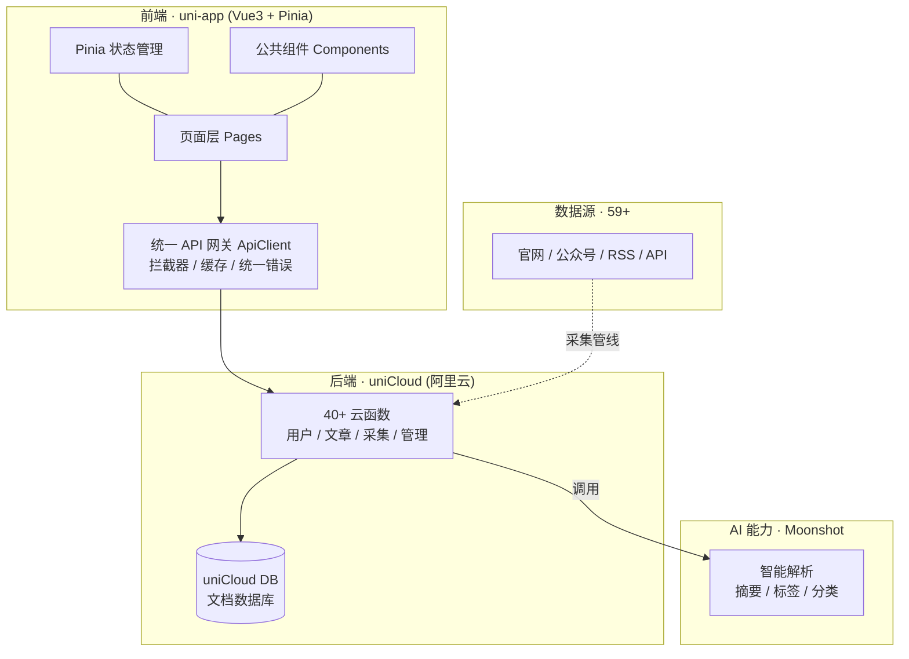

# 校易通（XiaoYiTong）· AI 驱动的校园信息聚合平台

> 统一校园信息入口，AI 自动解析与智能推荐，让师生用更少的时间获取更所需的信息。

[](https://opensource.org/licenses/MIT)
[](#技术栈)
[-07c160.svg)](#技术栈)

校易通是一款面向高校师生与行政人员的**校园信息聚合小程序**。校园通知公告、学术动态、社团活动、生活服务等信息分散在教务处官网、图书馆官网、各类公众号等十余个渠道，用户需逐个查看、效率低下。本项目通过**自动化采集 + AI 智能解析 + 个性化推荐**，将这些信息汇聚为统一入口，并按用户角色精准推送。

> 项目为「中国国际大学生创新大赛（2026）」高教主赛道 · 创意组（本科生组）备赛作品，已完成 MVP 开发。

---

## 目录

- [一、项目简介](#一项目简介)
- [二、技术架构](#二技术架构)
- [三、核心功能模块](#三核心功能模块)
- [四、项目亮点与技术难点](#四项目亮点与技术难点)
- [五、项目成果与应用场景](#五项目成果与应用场景)
- [六、个人贡献（简历素材）](#六个人贡献简历素材)
- [七、快速开始](#七快速开始)
- [八、测试](#八测试)
- [九、项目结构](#九项目结构)
- [十、相关文档](#十相关文档)
- [十一、成果简介（补充材料）](#十一成果简介补充材料)
- [许可证](#许可证)

---

## 一、项目简介

| 项 | 内容 |
|----|------|
| 项目名称 | 校易通 —— AI 驱动的校园信息聚合平台 |
| 项目类型 | 校园信息聚合小程序（uni-app + DCloud 云开发 + 大模型 AI） |
| 目标用户 | 高校学生、教职工、行政人员 |
| 核心价值 | 统一访问校园信息入口，AI 智能解析与个性化推荐 |
| 参赛赛道 | 中国国际大学生创新大赛（2026）高教主赛道 · 创意组 |
| 当前阶段 | 已完成 MVP 开发，准备校赛 |

**解决的痛点**：校园信息渠道碎片化、更新频繁、查找成本高。校易通以「多源聚合 + AI 解析 + 三角色推荐」为核心，提供 T+0 更新的信息流、热门排行、标签云、时间轴，以及收藏、历史、消息等个人化能力。

---

## 二、技术架构

### 技术栈

| 层级 | 技术选型 | 说明 |
|------|----------|------|
| 前端框架 | **uni-app + Vue 3** | 跨端小程序框架（微信小程序为主），组合式 API |
| 状态管理 | **Pinia 2.1**（已完成 Vuex → Pinia 迁移） | 用户状态 + 本地持久化 |
| UI 组件库 | **uni-ui 1.5** | 官方组件库 |
| 样式 | **SCSS** | 样式预处理 |
| 后端服务 | **DCloud uniCloud（阿里云）** | 云函数 + 云数据库（文档型） |
| AI 能力 | **Moonshot（Kimi）大模型** | 通过 OpenAI 兼容接口接入，用于摘要、标签、分类 |
| 接口层 | **统一 API 网关（自研 ApiClient）** | 拦截器链 + 缓存 + 统一错误处理 |
| 测试 | **Jest 29** + nock + uniCloud Mock | 组件 / 云函数 / 解析策略单元测试 |
| 开发工具 | HBuilderX + 微信开发者工具 | 调试与发布 |

### 架构总览



### 分层设计

1. **表现层（Pages / Components）**：首页信息流、发现页、详情页、个人中心等，配合骨架屏、空状态、错误页等通用组件提升体验。
2. **状态层（Pinia）**：用户登录态、角色、收藏等全局状态，落地本地存储做持久化与游客访问。
3. **接口层（api/）**：统一 `ApiClient` 封装 `uniCloud.callFunction`，内置请求/响应/错误拦截器、可选缓存（`CACHE_KEYS`）与一致的 `{ code, message, data }` 返回格式。
4. **服务层（uniCloud 云函数）**：按领域拆分的 40+ 云函数，处理登录鉴权、文章读写、采集解析、管理后台等。
5. **数据层（uniCloud DB）**：文档型数据库，核心集合含 `users / articles / sources / collections / readHistory / messages / subscriptions / admins / url_queue` 等。

---

## 三、核心功能模块

### 1. 用户与权限体系
- **微信一键登录**：`login` 云函数通过 `context.OPENID` 或 `jscode2session` 换取 openid，自动创建/更新用户。
- **三角色适配**：学生 / 教师 / 行政人员，注册时采集差异化画像（专业年级 / 院系职称 / 部门职责），驱动个性化推荐。
- **隐私合规**：首次启动弹出隐私政策同意框，未同意引导阅读完整协议，符合个人信息保护要求；支持游客访问。
- **个人中心**：收藏管理、阅读历史、消息通知、账号注销。

### 2. 内容聚合与浏览
- **首页信息流**：分类 Tab（全部 / 通知公告 / 学术动态 / 社团活动 / 生活服务）+ 筛选面板（数据源 / 标签 / 日期）。
- **详情页**：AI 摘要、正文、来源、相关标签，支持滑动收藏、下拉刷新、上拉加载。
- **搜索**：关键词搜索、搜索建议、热门搜索词、搜索历史。

### 3. 发现与推荐
- **热门排行**（`getHotArticles`）、**标签云**（`getTagCloud`）、**时间轴**（`getTimeline`）。
- 基于角色画像的个性化内容推荐。

### 4. AI 智能解析管线（`parseArticles`）
采用**策略模式**按数据源特性选择解析方式：
- `AiParseStrategy`：调用 Moonshot 大模型，自动抽取标题、正文、摘要、标签与分类；
- `RegexParseStrategy`：正则结构化解析；
- `RawParseStrategy`：原文直存。
配合 `keywordExtractor`、`sanitize` 等工具，统一产出结构化文章。

### 5. 数据采集与治理
- **采集链路**：`extractUrls`（URL 提取 / `urlQueueManager` 队列）→ `parseArticles` 解析 → 落库；`syncSources` 定时同步，T+0 更新。
- **数据源治理**：59+ 数据源按归属（机关部处 / 学院 / 直属单位）分类，设置 `priorityTier`（tier1 永久 / tier2 两年 / tier3 半年）留存策略与 `parseStrategy`，并做质量检查。

### 6. 管理后台（`pages/admin`）
- **仪表板**（`adminStats`）：核心数据统计；
- **文章审核**（`approveArticle`）：内容把关；
- **数据源管理**（`manageSources`）：CRUD 与批量操作、智能分类、策略配置；
- **用户管理**（`manageUsers` / `addAdmin`）：用户与权限维护。

---

## 四、项目亮点与技术难点

1. **统一 API 网关（自研）**：`ApiClient` 以拦截器链实现请求/响应/错误处理统一，支持可选缓存与一致返回结构，显著降低前端调用与异常处理复杂度。
2. **策略模式解析引擎**：针对异构数据源抽象出 AI / 正则 / 原文三套解析策略 + 工厂，便于横向扩展新数据源，是「多源聚合」的技术核心。
3. **数据源治理体系**：对 59+ 源做归属、优先级、留存策略与解析方式的精细化管理，解决「采得多但乱」的工程难题。
4. **自动化采集管线**：URL 提取 → 队列 → 解析 → 存储 的全链路，结合定时同步实现近实时更新，减少人工维护。
5. **AI 能力落地**：将大模型用于摘要、标签、分类，把非结构化网页转化为结构化、可推荐的内容。
6. **状态管理迁移**：完成 Vuex → Pinia 迁移并保留本地持久化，为组合式开发铺路。
7. **工程化与测试**：引入 Jest 对组件、云函数（nock + uniCloud Mock）、解析策略编写单元测试，保障重构质量。
8. **合规与体验细节**：隐私政策同意流、游客模式、骨架屏 / 空状态 / 错误页等，兼顾合规与体验。

---

## 五、项目成果与应用场景

- **应用价值**：为高校师生提供「一个入口看全校信息」的能力，显著降低信息获取成本，适用于日常通知查阅、学术动态追踪、活动参与、生活服务查询等场景。
- **赛事进展**：作为创新训练项目参赛，已完成 MVP 并进入校赛准备阶段。
- **可扩展性**：采集与解析管线、数据源治理体系可快速接入新渠道；三角色推荐框架可延伸至更精细的个性化服务。

---

## 六、个人贡献（简历素材）

> 以下基于代码库实证梳理，可作为简历 / 面试叙述的素材，具体措辞可按实际分工微调。

- **项目统筹与技术负责人**：主导校易通的整体架构设计，界定前端、云函数、数据库与 AI 能力的协作边界。
- **前端架构与开发**：基于 uni-app + Vue 3 搭建页面体系与组件库；主导 **Vuex → Pinia 迁移**并落地本地持久化；实现隐私合规与游客访问。
- **接口层设计**：设计并实现**统一 API 网关**（拦截器链 + 缓存 + 统一错误格式），规范前后端协作。
- **AI 解析管线**：以**策略模式**构建 `parseArticles`（AI / 正则 / 原文），接入 Moonshot 大模型完成摘要、标签与分类抽取。
- **数据采集与治理**：搭建 URL 提取 → 队列 → 解析 → 落库的全链路采集管线，设计 59+ 数据源的归属 / 优先级 / 留存 / 解析策略治理体系与定时同步。
- **管理后台**：实现仪表板、文章审核、数据源管理、用户与权限管理。
- **工程化**：引入 Jest 单元测试与 Mock 方案，覆盖组件、云函数与解析策略，保障迭代质量。

---

## 七、快速开始

### 环境要求
- HBuilderX 3.8.0+
- Node.js 16.0+
- 微信开发者工具
- 一个 DCloud uniCloud 云服务空间（阿里云）

### 本地运行
```bash
# 1. 安装依赖
npm install

# 2. 用 HBuilderX 打开项目，关联 uniCloud 云服务空间（右键项目 → 云服务空间）

# 3. 配置环境变量（敏感凭证切勿写入代码，统一在 uniCloud 云函数环境变量中配置）
#    Moonshot:  MOONSHOT_API_KEY
#    微信登录:  WX_APPSECRET   （微信公众平台「开发 → 开发设置」中获取/重置）
#    ⚠️ 本项目已将 AppSecret 从前端代码移除，仅由云函数 login 通过环境变量读取。

# 4. 运行到微信小程序模拟器
#    HBuilderX：「运行 → 运行到小程序模拟器 → 微信开发者工具」
```

### 目录说明（运行态）
- 前端源码：`pages/`、`components/`、`api/`、`store/`、`utils/`、`config/`、`styles/`、`static/`
- 云函数：`uniCloud-aliyun/cloudfunctions/`
- 文档：`docs/`（需求 / 数据库设计 / API / 云函数设计 / 总体开发）

---

## 八、测试

```bash
npm test                 # 运行全部 Jest 单元测试
npm run test:watch      # 监听模式
npm run test:coverage   # 覆盖率
```

测试覆盖：`tests/unit/components`（组件）、`tests/unit/cloudfunctions`（云函数）、`tests/unit/strategies`（解析策略），配合 `tests/mocks`（httpGet / uniCloud Mock）与 `tests/setup.js`。

---

## 九、项目结构

```
My_School_Store_Tool/
├── api/                     # 统一 API 网关 + 业务接口（article / user / admin）
├── components/              # 公共组件（ArticleCard / Skeleton / EmptyState / ErrorPage / FilterPanel）
├── store/                   # Pinia 状态管理（modules/user）
├── utils/                   # 工具函数与组合式（cache / format / storage / composables）
├── config/                  # 环境配置（不含敏感凭证）
├── pages/                   # 页面（index / discover / mine / detail / collection / history / message / search / login / about / admin）
├── styles/                  # 全局样式（SCSS）
├── static/                  # 静态资源
├── uniCloud-aliyun/         # 云开发（40+ 云函数 + 数据库 schema）
│   └── cloudfunctions/      # login / getArticles / parseArticles / extractUrls / manageSources / admin* ...
├── docs/                    # 项目文档
├── tests/                   # Jest 单元测试与 Mock
├── App.vue / main.js        # 应用入口
├── pages.json / manifest.json  # 页面与工程配置
└── README.md
```

---

## 十、相关文档

- [完整需求文档](docs/完整需求文档.md)
- [数据库设计文档](docs/数据库设计文档.md)
- [API 接口文档](docs/API接口文档.md)
- [云函数设计文档](docs/云函数设计文档.md)
- [总体开发文档](docs/总体开发文档.md)

---

## 十一、成果简介（补充材料）

- [「校易通」微信小程序 · 成果简介（PDF）](docs/校易通-成果简介.pdf)：项目成果与核心能力的一页式概览，适合快速了解与评审查阅。

---

## 许可证

[MIT](https://opensource.org/licenses/MIT)
